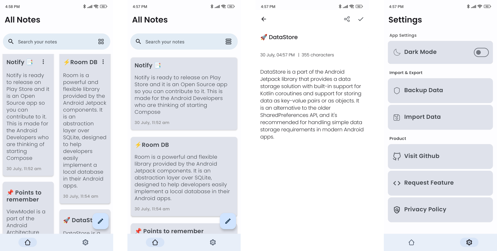
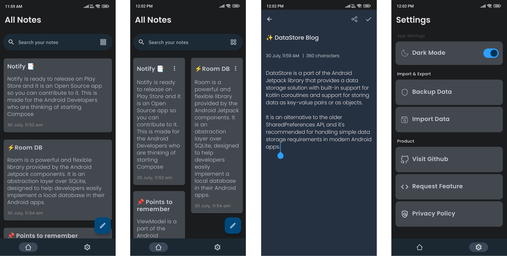
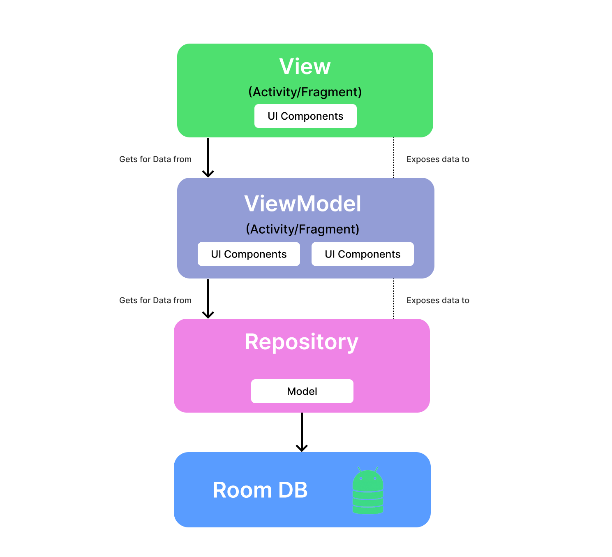

<div align="center">
</br>


</div>

<h1 align="center">Notify</h1>

</br>
<p align="center">
  </a>
  </a>
  </a> 
  </a>
  </br>
  </br>
</p>

<h4>📝Notify is a simple note application that is built with Modern Android development tools.    
This project showcases the Good implementation of Android with proper architecture design.              
Made with ♥ for all Android Developers</h4>

# ⬇️ Download
<a href="https://play.google.com/store/apps/details?id=com.aritra.notify">

# Features ✨

_Notify_ focuses on the following key things:

- [x] Single Activity Design.
- [x] Offline Capability - Notes. ✈️
- [x] Clean and Simple Material UI. 🎨
- [X] Dark mode. 🌗
- [X] Back/Restore feature. 👀
- [x] Jetpack Compose UI. 🖌
- [x] Switch between layouts. 🌟
- [x] Share the notes in the form of Text, Image & PDF 📤

# Design ✨
#### 🌞 Light Mode



#### 🌛 Dark Mode



# Built with 🛠

- [Kotlin](https://kotlinlang.org/) - First class and official programming language for Android development.
- [Coroutines](https://kotlinlang.org/docs/reference/coroutines-overview.html) - For asynchronous calls and tasks to utilize threads.
- [Jetpack Compose UI Toolkit](https://developer.android.com/jetpack/compose) - Modern UI development toolkit.
- [Android Architecture Components](https://developer.android.com/topic/libraries/architecture) - Collection of libraries that help you design robust, testable, and maintainable apps.
  - [LiveData](https://developer.android.com/topic/libraries/architecture/livedata) - Data objects that notify views when the underlying database changes.
  - [ViewModel](https://developer.android.com/topic/libraries/architecture/viewmodel) - Stores UI-related data that isn't destroyed on UI changes.
  - [Room](https://developer.android.com/topic/libraries/architecture/room) - Room is an Android library which is an ORM that wraps Android's native SQLite database.
  - [StateFlow and SharedFlow](https://developer.android.com/kotlin/flow/stateflow-and-sharedflow#:~:text=StateFlow%20is%20a%20state%2Dholder,property%20of%20the%20MutableStateFlow%20class.) - StateFlow and SharedFlow are Flow APIs that enable flows to optimally emit state updates and emit values to multiple consumers.
- [Dependency Injection](https://developer.android.com/training/dependency-injection) -
    - [Hilt-Dagger](https://dagger.dev/hilt/) - A standard way to incorporate Dagger dependency injection into an Android application.
    - [Hilt-ViewModel](https://developer.android.com/training/dependency-injection/hilt-jetpack) - DI for injecting ```ViewModel```. 
- [Material Components for Android](https://github.com/material-components/material-components-android) - Modular and customizable Material Design UI components for Android.
- [Accompanist](https://google.github.io/accompanist/) - A collection of extension libraries for Jetpack Compose

# Architecture 👷‍♂️
This app uses [MVVM(Model View View-Model)](https://developer.android.com/topic/architecture#recommended-app-arch) architecture.


